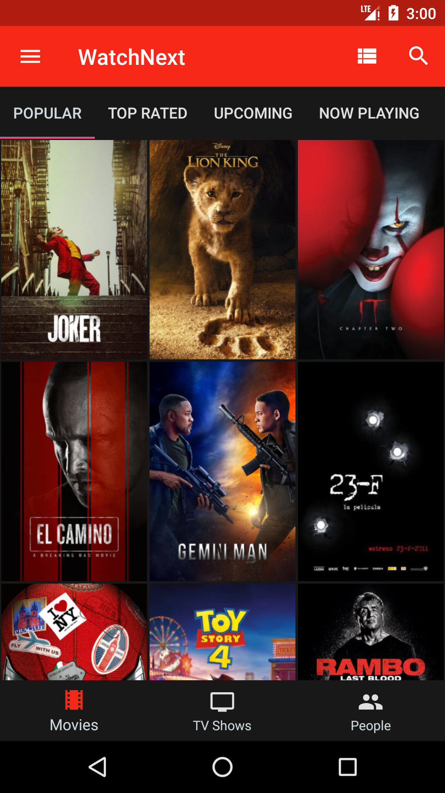
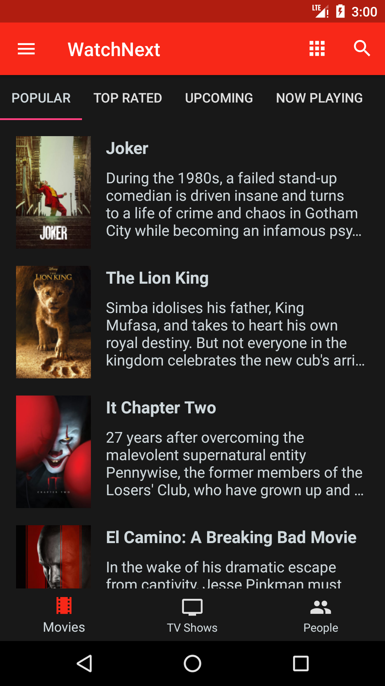
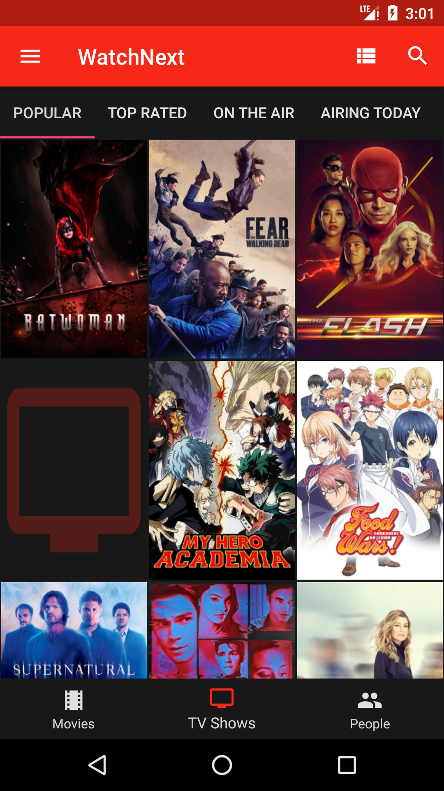
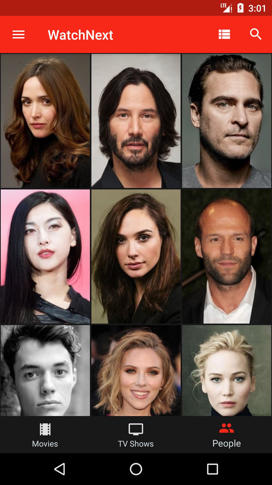
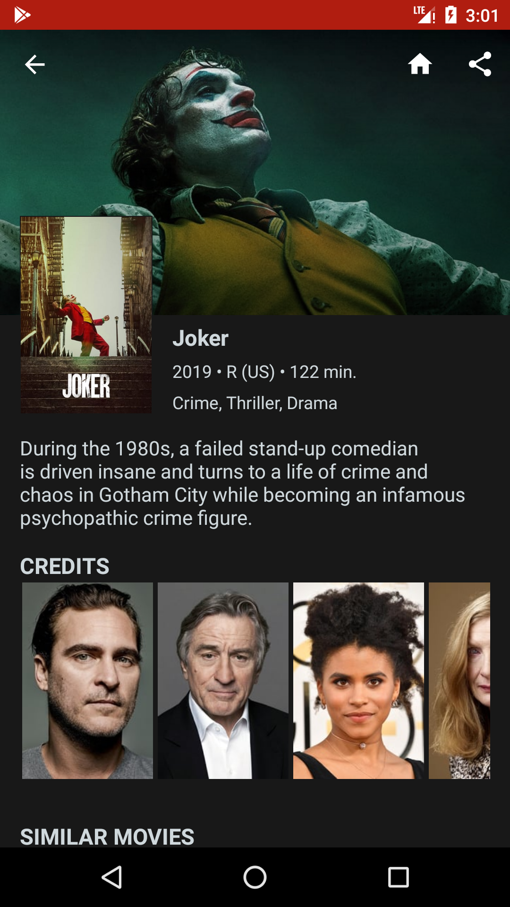
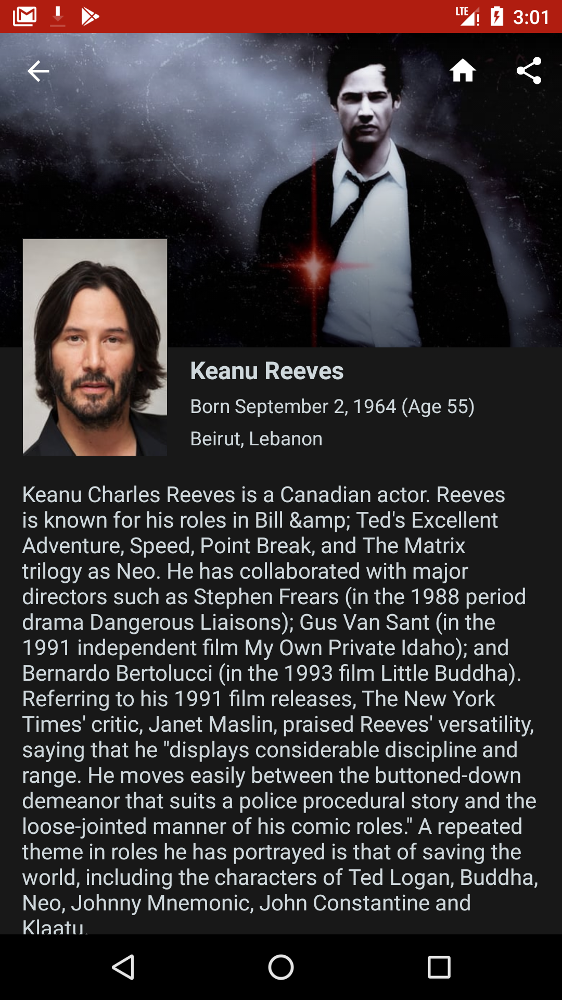
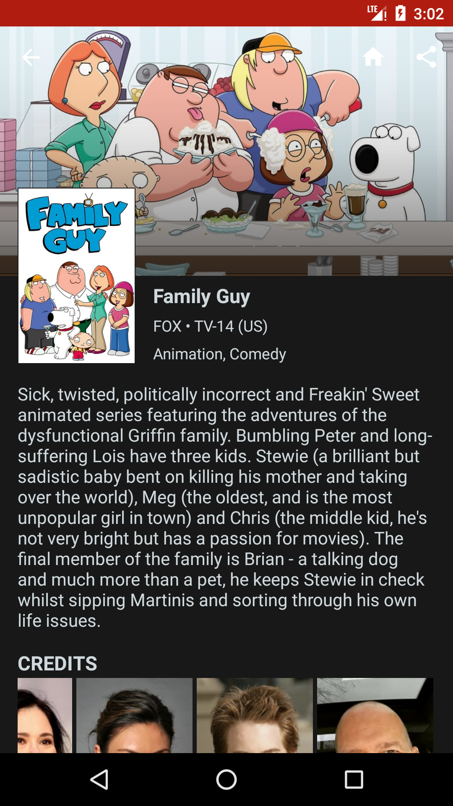
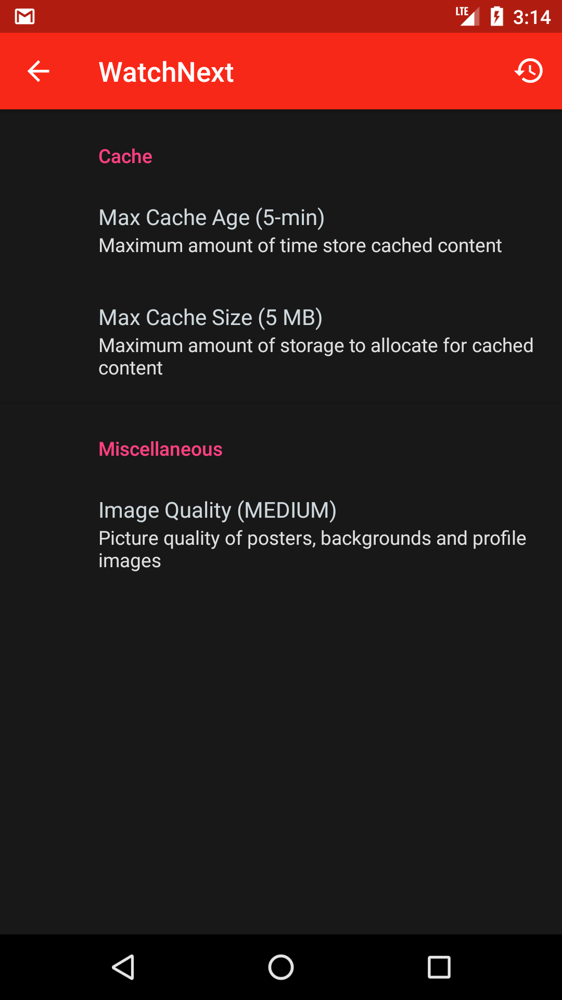

WatchNext
===
An app demonstrating an implementation of [Uncle Bob's Clean Architecture](https://8thlight.com/blog/uncle-bob/2012/08/13/the-clean-architecture.html)

### Implementation
* Model-View-Presenter
* Dagger Dependency Injection
* Clean Architiecture via Presentation / Data / Domain / Platform modules

### Getting Started
1. Visit [TheMovieDB](https://www.themoviedb.org/settings/api) and register for an account
1. Create an API key
1. In the `watchnext-app` folder create a file called `settings.properties`
1. Inside settings.properties add this line `themoviedb.api_key=<KEY>` where `<KEY>` is the v3 auth key you created in step 3
1. Run the project

### Screenshots

